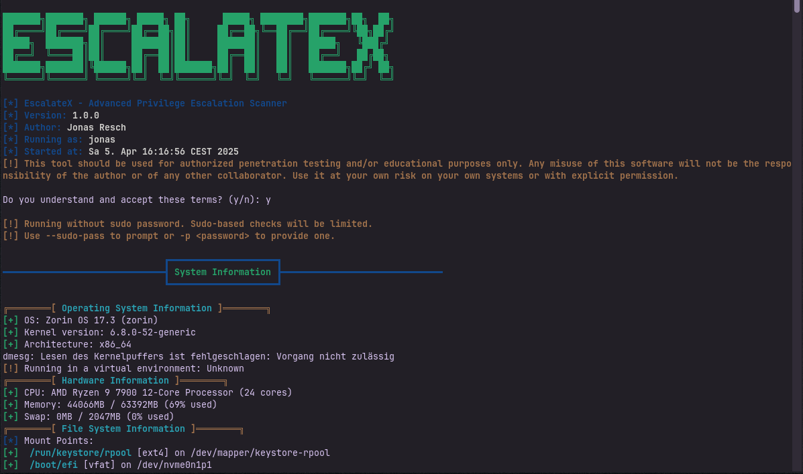

# EscalateX

<div align="center">


[](https://creativecommons.org/licenses/by-nc/4.0/)




**A powerful Linux privilege escalation scanner for security professionals**

</div>

## 📖 About

EscalateX is a cybersecurity tool designed to identify privilege escalation vectors on Linux systems. Automating the process of finding potential vulnerabilities and a modern alternative to LinPEAS is the purpose of EscalateX. 

The tool is currently in its early development phase. Bugs can and will occur while running the tool - therefore, please report your findings by sending me an email.

### Key Features

- ✅ **System Configuration Analysis**: Identifies misconfigurations in system settings
- ✅ **Privilege Abuse Detection**: Locates SUID/SGID binaries and dangerous capabilities
- ✅ **Filesystem Vulnerability Scanning**: Finds writable files in sensitive locations
- ✅ **Kernel Exploit Detection**: Discovers kernel vulnerabilities that could lead to privilege escalation
- ✅ **Container Security**: Evaluates potential container escape vectors

## 🚀 Installation

Quick setup in three simple steps:

```bash
# Clone the repository
git clone https://github.com/reschjonas/EscalateX.git

# Navigate to the directory
cd EscalateX

# Make it executable
chmod +x escalatex.sh
```

### 📋 Requirements

Runs on most Linux distributions with:
- Bash 4.0+
- Standard Unix utilities (find, grep, ls, etc.)
- The `timeout` command (optional but recommended)

## 💻 Usage

### Basic Operation

Simply run the script:

```bash
./escalatex.sh
```

### Advanced Options

```bash
# Run a comprehensive scan (longer but more thorough)
./escalatex.sh --thorough

# Target specific checks only
./escalatex.sh --only system_info,suid_sgid

# Use elevated privileges for deeper analysis
./escalatex.sh --multi --password yourpassword

# Maximum depth scan for critical systems
./escalatex.sh --extreme
```

### Command Line Options

<details>
<summary><b>Click to expand all options</b></summary>

#### Core Options
- `-a, --all` - Run all checks (thorough mode)
- `-t, --thorough` - More comprehensive but slower scan
- `-x, --extreme` - Maximum depth scan for critical systems
- `-o, --only CHECKS` - Run specific checks (comma-separated)
- `-d, --dir PATH` - Check a specific directory
- `-m, --multi` - Use multiple threads (default)
- `-s, --single` - Single-threaded mode
- `--threads N` - Set number of threads for multithreaded mode

#### Output Options
- `-q, --quiet` - Minimal output
- `-n, --no-color` - Turn off colors
- `-w, --wait` - Pause between check groups

#### Advanced Options
- `-p, --password PWD` - For sudo operations
- `-S, --sudo-pass` - Prompt for sudo password for privilege escalation attempts
- `-D, --debug` - Verbose logging
- `-h, --help` - Show help
</details>

## 🔍 What It Checks For

<details>
<summary><b>System Information</b></summary>

- OS details and kernel version
- Security configurations and patch status
- Hardware info and resource usage
- Filesystem mounts and permissions
- Boot configuration and services
</details>

<details>
<summary><b>User & Permissions</b></summary>

- Current user privileges
- User enumeration and group memberships
- Password policy issues
- Sudo rules that could be abused
- Home directory permissions
</details>

<details>
<summary><b>Privilege Escalation Vectors</b></summary>

- SUID/SGID binaries (especially exploitable ones)
- Files with dangerous capabilities
- Custom privilege escalation paths
- Container security issues
</details>

<details>
<summary><b>Filesystem Issues</b></summary>

- Writable files in sensitive locations
- Misconfigured home directory permissions
- PATH manipulation vulnerabilities
- Wildcard injection opportunities
</details>

## 📊 Sample Output

<details>
<summary><b>Click to see sample scan results</b></summary>

```
┏━━━━━━━━━━━━━━━━━━━━━━━━━━ System Information ━━━━━━━━━━━━━━━━━━━━━━━━━━┓

╔════════[ Operating System Information ]════════╗
[+] OS: Ubuntu 20.04.3 LTS (ubuntu)
[+] Kernel version: 5.11.0-27-generic
[+] Architecture: x86_64
[+] Running on physical hardware

╔════════[ Hardware Information ]════════╗
[+] CPU: Intel(R) Core(TM) i7-10700K CPU @ 3.80GHz (8 cores)
[+] Memory: 6453MB / 16000MB (40% used)
[+] Swap: 2048MB / 4096MB (50% used)

...

┏━━━━━━━━━━━━━━━━━━━━━━━━━━ SUID/SGID Binaries and Capabilities ━━━━━━━━━━━━━━━━━━━━━━━━━━┓

╔════════[ SUID/SGID Binaries ]════════╗
[*] Looking for SUID binaries (might take a while)...
[+] Found 35 SUID/SGID binaries:
[!] /usr/bin/sudo [Owner: root]
   → Purpose: Execute commands as root with proper permissions
[!] /usr/bin/pkexec [Owner: root]
   → Purpose: Execute commands as another user with policykit
[CRITICAL] /usr/bin/python3 [Owner: root]
   → Exploitable: python -c 'import os; os.execl("/bin/sh", "sh", "-p")'

...

┏━━━━━━━━━━━━━━━━━━━━━━━━━━ Scan Summary ━━━━━━━━━━━━━━━━━━━━━━━━━━┓

[*] EscalateX scan completed at Wed Feb 14 14:32:18 EST 2024
[*] Remember to check the most promising privilege escalation vectors highlighted in red

Thank you for using EscalateX!
```
</details>

## 🗺️ Roadmap

<div align="center">
  
### Future Development Plans

</div>

| Feature | Status | Description |
|---------|--------|-------------|
| 📑 **Report Generator** | Planned | Create comprehensive HTML/PDF reports with findings and remediation recommendations |
| 🔍 **Service Version Scanning** | Planned | Identify outdated software versions running as services |
| 🌐 **Real-time CVE Collection** | Planned | Connect to vulnerability databases to map identified software versions to known CVEs |
| 🛠️ **Automatic Vulnerability Exploiter** | Considering | Optional module to automatically exploit identified vulnerabilities |

<div align="center">
</div>

## 🧩 Custom Modules

You can extend EscalateX with your own custom modules:

<details>
<summary><b>How to create custom modules</b></summary>

1. Create a script in the modules directory
2. Use this basic structure:

```bash
#!/bin/bash

# Title: My Custom Check
# Description: What this thing does

check_something_interesting() {
  print_subtitle "My Interesting Check"
  
  # Your check logic here
  print_info "Checking something..."
  
  # Found something worth noting
  print_warning "Hmm, that's interesting"
  
  # Found something bad
  print_critical "This is definitely exploitable"
}

# Main function
custom_checks() {
  print_title "My Custom Stuff"
  
  # Run your checks
  check_something_interesting
  
  # Pause if wait mode is on
  wait_for_user
}
```

3. Add your module to loader.sh
</details>

## ⚠️ Important Warning

<div align="center">
  
**This is a security tool. Use it responsibly.**

</div>

- 🔒 Only run it on systems you own or have permission to test
- 🚨 Some checks might trigger security alerts or monitoring
- ⚙️ Be careful in production environments
- 🤝 Don't be a jerk - never use this for unauthorized access

## 📝 License

<div align="center">
  
[](https://creativecommons.org/licenses/by-nc/4.0/)

</div>

This project is licensed under the Creative Commons Attribution-NonCommercial 4.0 International License (CC BY-NC 4.0) - see the [LICENSE](LICENSE.md) file for details.

This means you can freely use, modify, and distribute this software, as long as:
- You give appropriate credit to the original author
- You don't use it for commercial purposes

For more information, visit: https://creativecommons.org/licenses/by-nc/4.0/

## 👥 Contributing

Contributions are welcome and appreciated! To contribute:

1. Fork the repository
2. Create a branch (`git checkout -b cool-new-feature`)
3. Commit your changes (`git commit -m 'Added some cool feature'`)
4. Push to your branch (`git push origin cool-new-feature`)
5. Open a Pull Request

<div align="center">
  
**[⬆ Back to top](#escalatex)**

</div> 
